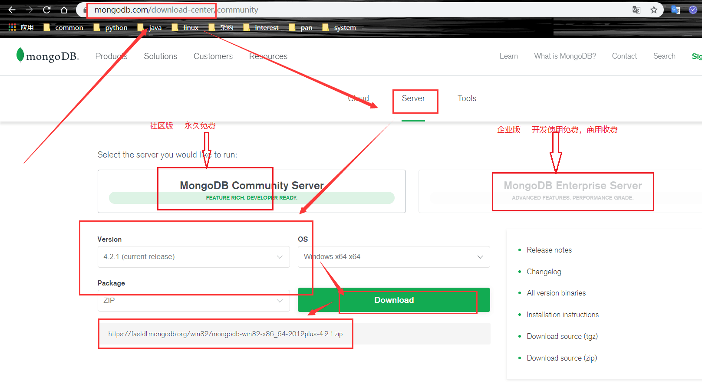

# 一、下载 MongoDB

```

# 下载地址 : 
https://www.mongodb.com/download-center

# 注意版本一定要对上，不然会报错的...
# ubuntu 下载18.4地址 : 
https://fastdl.mongodb.org/linux/mongodb-linux-x86_64-ubuntu1804-4.2.1.tgz
# ubuntu 下载16.4地址 : 
https://fastdl.mongodb.org/linux/mongodb-linux-x86_64-ubuntu1604-4.2.1.tgz

# /usr/software/software-back/ 是 mongodb 安装包的地址
wget -P /usr/software/software-back/ https://fastdl.mongodb.org/linux/mongodb-linux-x86_64-ubuntu1604-4.2.1.tgz

# 查看Linux系统版本的命令
cat /etc/issue

```

官网下载 : 



1. 企业版 - 开发环境免费使用
2. 社区版 - 所有环境免费使用
3. 选择合适的 OS 版本，正式版本是偶数，奇数是开发版本
4. TGZ 版本包含(所有) : server mongos tools 和 shell


# 二、ubuntu 安装

```

# 解压
# tar -zxvf ./mongodb-linux-x86_64-ubuntu1604-4.2.1.tgz
# /usr/software/app/ 是 mongodb 的安装目录
tar -zxvf /usr/software/software-back/mongodb-linux-x86_64-ubuntu1604-4.2.1.tgz -C /usr/software/app/

# 把 mongo 设置为环境变量

vim ~/.bashrc
# 指定到解压文件的 bin 目录
export PATH=$PATH:/usr/software/app/mongodb-linux-x86_64-ubuntu1604-4.2.1/bin

source ~/.bashrc 

# 创建 MongoDB 的数据库
mkdir -p /data/mongo/db
mongod --dbpath /data/mongo/db --port 27017 --logpath /data/mongo/db/mongod.log --fork --bind_ip 0.0.0.0

# 检查是否安装成功
mongo -version

```

# 三、安装过程遇到的错误:

```
mongod: error while loading shared libraries: libcurl.so.4: cannot open shared object file: No such file or directory

# 处理 --> 添加 crul
sudo apt install curl

```

# 四、简单操作

### 连接到 mongo

```shell script
cd <mongodb installation dir>/bin
# 本地默认端口
mongo
# 本地指定端口
mongo --port 28015
# 远程连接 mongo
mongo "mongodb://mongodb0.example.com:28015"
mongo --host mongodb0.example.com:28015
mongo --host mongodb0.example.com --port 28015
```

### 数据库简单操作

```
# 显示当前使用的数据库
db

# 显示所有的数据库
show dbs

# 选择一个数据库(这里选择 test 数据库 )
use test
```